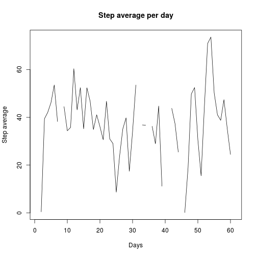
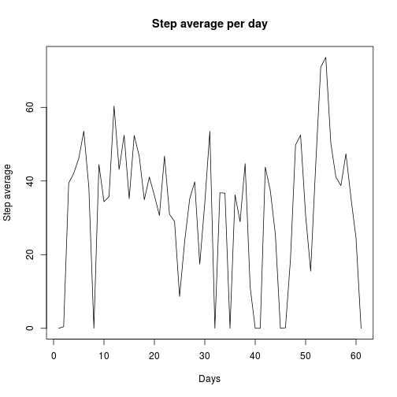
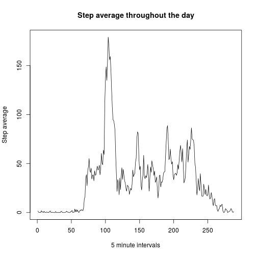

#Tarea 1: Biologia computacional

##Introduccion

En el siguiente estudio se van a analizar datos que consisten en los pasos que recorrio una determinada persona
entre los meses de octubre y de noviembre del 2012. Estos datos fueron recolectados por dispositivos como Fitbit o 
Nike Fuelband, los cuales registraban datos cada 5 minutos del dia.

##Análisis de datos

###Una seccion donde se carguen y pre-procesen los datos.

Los datos son obtenidos a partir de la tabla "activity.csv". Ademas, para facilitar el manejo de la informacion
de la tercera columna y como se sabe que los zapatos registran datos cada 5 minutos, se dividieron todos los numeros
entre 5 para facilitar el manejo de la tercera columna.


```r
setwd("/home/juanrr/Documents/Posgrado/Maestria_en_Biología_Integrativa/Módulos/Computacional_I/Fernanda")
activity<-read.csv("activity.csv",header=TRUE,sep=",")
activity[,3]<-activity[,3]/5
head(activity)
```

```
##   steps       date interval
## 1    NA 2012-10-01        0
## 2    NA 2012-10-01        1
## 3    NA 2012-10-01        2
## 4    NA 2012-10-01        3
## 5    NA 2012-10-01        4
## 6    NA 2012-10-01        5
```

Debido a la falta de datos, corri el siguiente comando con el fin de identificar un patron de los datos.
Efectivamente hay 8 dias en los que los datos faltantes estan concentrados.


```r
table(activity[is.na(activity[,1]),2])
```

```
## 
## 2012-10-01 2012-10-02 2012-10-03 2012-10-04 2012-10-05 2012-10-06 
##        288          0          0          0          0          0 
## 2012-10-07 2012-10-08 2012-10-09 2012-10-10 2012-10-11 2012-10-12 
##          0        288          0          0          0          0 
## 2012-10-13 2012-10-14 2012-10-15 2012-10-16 2012-10-17 2012-10-18 
##          0          0          0          0          0          0 
## 2012-10-19 2012-10-20 2012-10-21 2012-10-22 2012-10-23 2012-10-24 
##          0          0          0          0          0          0 
## 2012-10-25 2012-10-26 2012-10-27 2012-10-28 2012-10-29 2012-10-30 
##          0          0          0          0          0          0 
## 2012-10-31 2012-11-01 2012-11-02 2012-11-03 2012-11-04 2012-11-05 
##          0        288          0          0        288          0 
## 2012-11-06 2012-11-07 2012-11-08 2012-11-09 2012-11-10 2012-11-11 
##          0          0          0        288        288          0 
## 2012-11-12 2012-11-13 2012-11-14 2012-11-15 2012-11-16 2012-11-17 
##          0          0        288          0          0          0 
## 2012-11-18 2012-11-19 2012-11-20 2012-11-21 2012-11-22 2012-11-23 
##          0          0          0          0          0          0 
## 2012-11-24 2012-11-25 2012-11-26 2012-11-27 2012-11-28 2012-11-29 
##          0          0          0          0          0          0 
## 2012-11-30 
##        288
```

###Reportar la media y la mediana del número de pasos tomados por día.

Ignorando los NAs en vista de lo encontrado previamente, para descartar los dias sin datos.


```r
by.day<-tapply(activity[,1],activity[,2],mean)
mean(by.day,na.rm=TRUE)
```

```
## [1] 37.3826
```

```r
median(by.day,na.rm=TRUE)
```

```
## [1] 37.37847
```

###Incluir una grafica que permita visualizar los patrones de actividad diaria.

Grafica del promedio por dia.
Debido a los datos faltantes de estos 8 dias quedan espacios vacios en los datos.


```r
plot(1:length(by.day),by.day,type="l",main="Step average per day",xlab="Days",ylab="Step average")
```

 

###Comparar los valores de actividad (numero de pasos) en los fines de semana contra el resto de la semana.

Para calcular el promedio del fin de semana primero se obtiene un vector con los dias de la semana
correspondientes a cada fecha. Luego se saca el promedio de todos los datos del sabado y domingo.
Asimismo, uso el set original de datos donde la fecha no fue convertida a numero para poder obtener
la informacion del dia de la semana.


```r
days <-format(as.Date(activity[,2]),format="%a")
mean(activity[days=="Sun"|days=="Sat",1],na.rm=TRUE)
```

```
## [1] 43.07837
```

Posteriormente calcule el promedio de todos los demas dias que no fueron contemplados en el paso anterior.
Asi se calcula el promedio entre semana.


```r
mean(activity[!(days=="Sun"|days=="Sat"),1],na.rm=TRUE)
```

```
## [1] 35.33796
```

###Proponer una manera de reemplazar los NA’s con valores (basados en los datos que tienen) y reemplazarlos.

Una posibilidad seria igualarlos a cero.
Asimismo, en este caso para hacer el paso de la sustitucion de datos faltantes por cero y para facilitar
el graficar los datos en pasos posteriores se convirtio la columna de fecha en numeros del 1 al 61.


```r
setwd("/home/juanrr/Documents/Posgrado/Maestria_en_Biología_Integrativa/Módulos/Computacional_I/Fernanda")
activity<-read.csv("activity.csv",header=TRUE,sep=",")

activity[,3]<-activity[,3]/5
activity[,2]<-as.numeric(activity[,2])
activity.clean<-activity

for(i in 1:nrow(activity)){
  if(is.na(activity[i,1])){
    activity.clean[i,]<-c(0,activity[i,2],activity[i,3])
  }else{
    activity.clean[i,]<-as.numeric(activity[i,])
  }
}
```

Otra posibilidad seria darles valores de acuerdo al dia anterior y posterior, pero esto seria adecuado si solo se tuvieran
los promedios y medias como buscando completar la grafica presentada anteriormente. En lugar de eso, hay muchos datos y muy
detallados por cada lapso de tiempo del dia, por lo que seria mas complicado querer llegar a tantos resultados promedio.

###Volver a calcular 2,3 y 4 con los valores reemplazados.

Se calcula la media y el promedio de los nuevos datos limpiados. Un detalle es que por igualar a cero los
datos faltantes el promedio termina disminuyendo por ser considerados. Mientras que la media se pierde por
el gran numero de ceros que hay ahora en los datos.


```r
mean(activity.clean[,1],na.rm=TRUE)
```

```
## [1] 32.47996
```

```r
median(activity.clean[,1],na.rm=TRUE)
```

```
## [1] 0
```

Grafica del promedio por dia con los nuevos datos


```r
by.day.clean<-tapply(activity.clean[,1],activity.clean[,2],mean)
plot(1:length(by.day.clean),by.day.clean,type="l",main="Step average per day",xlab="Days",ylab="Step average")
```

 

Grafica del promedio por hora del dia
No se podia hacer este analisis sin ignorar los NAs, por lo que decidi implementarlo una vez que me encargue de los datos faltantes.


```r
by.interval.clean<-tapply(activity.clean[,1],activity.clean[,3],mean)
plot(1:length(by.interval.clean),by.interval.clean,type="l",main="Step average throughout the day",xlab="5 minute intervals",ylab="Step average")
```

 

###Discutir los resultados y concluir.

El aparato presento fallas en dias completos especificos, lo cual podria ayudar a deducir a que se debieron. 
El manejo de estas fallas hizo que se alteraran un poco los datos, sin embargo, era necesario lidiar con ellas
para poder observar patrones interesantes en los datos. Uno de los patrones encontrados fue que la persona
solia recorrer mas pasos los fines de semana a diferencia de su contraparte, aproximadamente 8 pasos mas.
Asimismo, otro dato muy claro fue que el individuo solia recorrer mas pasos a los 500 minutos del dia (o el
lapso 100 que corresponderia a las 8:20 am) a diferencia de cualquier otra hora del dia, posiblemente por
tener una rutina de ejercicio a esa hora o debido a la distancia que tenia que recorrer para llegar a su 
trabajo.
De la misma manera se ve una ausencia de pasos recorridos despues del lapso 250 (~8:50 pm) y antes del 70 
(~6 am), posiblemente relacionada con la hora de dormir o de llegada a su casa.

